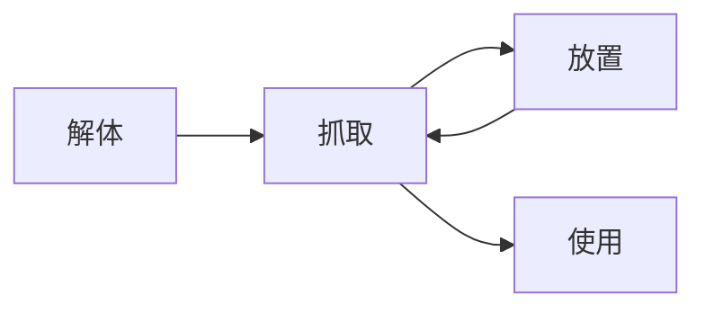

# BEHAVIORS / 行为

## Properties / 属性

### Floating / 漂浮

- 可「漂浮」物体的海拔随[水位]变化而变化。物体锚点的 y 坐标尝试与水平面齐平，因此锚点的位置决定了物体的“排水量”。
- 水位快速变化时，物体快速上浮或下落，无需完全模拟浮力。在快速上浮或下落过程中，该物体无法交互。
- 物体的 x、z 坐标不受水的影响。

## Interactions / 交互

### Grabbing / 抓取

- 可「抓取」的物体可以被玩家左键抓取，抓取后吸附在视野中心，随玩家移动且与玩家的距离保持抓取时的距离不变，物体的姿态冻结，可以用右键拖拽绕y轴旋转。
- 当「抓取」的物体接触到任意碰撞体（包括地面、玩家、其他可「抓取」的物体）时，物体被[「放置」]；若视点与被抓取物体间检测到了其他物体，物体被[「放置」]。因此，当玩家距离物体太近或玩家面前没有足够的空间时，是无法「抓取」起物体的。

### Placing & Using / 放置与使用

- [「抓取」]状态下，可以左键「使用」或「放置」该物体，取决于玩家是否处在可「使用」的范围内。
- 「放置」即断开物体与玩家的连接，将物体放在当前位置，同时玩家退出[「抓取」]状态。
- 当玩家的坐标和视角处在实际关卡规定的小范围内时，判定玩家可以「使用」手中的物体，此时坐标与视角自动吸附到某个确切的状态；吸附过程中及结束后，玩家依然可以不受阻力地离开。吸附过程中（这是一个很短的时间）玩家无法左键交互；吸附结束后，玩家按下左键，手中的物体**消失**，并触发相关的事件。

### Detaching / 解体

- 可「解体」的物体在交互后脱离原本的层级关系，直观体现为从一个整体上被拆了下来。若物体同时是可以[「抓取」]的，那么玩家在拆下物体后的交互中才能拿起；否则想要拿起它们是不可能的。
- 可「解体」的物体之上可以有其他可「解体」的物体，当交互射线首先接触子物体时，只「解体」子物体，父物体不响应。

### Switching / 开关

- 可「开关」的物体在每次左键点击时，切换目标体（Target）的状态。目标体可以是自身也可以不是，不同的状态至少有两种。
    > 这里的状态包括可见性、材质（颜色、纹理、自发光）、模型（比如单掷开关的扳动）、位置（比如开一扇门）等。
- 「开关」有两种类型，一种是“全线循环”，能够循环切换到目标体的所有状态；一种是“区间单程”，只能取所有状态的部分区间，单向切换，到区间末尾后终止响应。
- 「开关」与「抓取」「放置」「解体」在一次交互中是可以共存的。

[「抓取」]: mechanics/Behaviors.md#Grabbing--抓取
[「放置」]: mechanics/Behaviors.md#Placing-&-Using--放置与使用
[水位]: mechanics/Water.md
