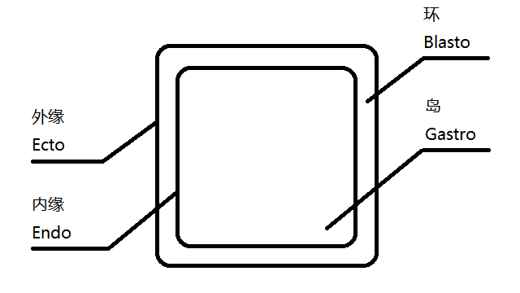

# PATTERN / 回形图案

## Introduction / 引入

- 游戏主要引入了「**回形图案可以交互**」这一机制。为方便描述，此处围绕这种图案定义一些名词。

- 如上图，这种图案无论是内缘还是外缘，都只能是由一条简单闭曲线构成的闭区域（凹凸均可）。整个图案也可以理解为岛及其磅数很高的描边。
- 图案符合标准的重要条件是：环在光滑的各处宽度相同（依制作难度，近乎相同也可），且总是与1/12游戏画面高度相当（在1920x1080显示中，宽度约为90像素）。

## Back of the Pattern / 回形背面

- 无论是在平面上还是三维空间中，回形的背面都不应该展示给玩家。换言之，回形应尽量贴不透明墙设计。
  > 形如门框的两面不视为同一个回形，而是两个回形背对背靠在了一起。

## Optical Patterns / 光学回形

- 玩家站在符合游戏预期的位置，屏幕空间中出现了回形，那么岛的部分就可以交互。此时的岛是交互后[「解体」]的。

- 举例：

  1. 玩家在高处俯瞰一个规整地放在大方砖上的小方块，视野中就出现了回形。此时玩家点击小方块的顶面，小方块消失，小方块的顶面以贴图的形式覆盖在大方砖中心，并且该区域[「解体」]，出现向下延伸的空间。 

  2. 玩家用[「抓取」]的方块与墙上的方形线框组成了回形，[「使用」]后，屏幕中方块的区域被抓屏贴在墙上岛的区域，岛[「解体」]倒下，玩家钻过这个洞进入下个房间。  

  3. （这种情况应当尽量避免。）玩家用[「抓取」]的方块覆盖了墙上原有的回形，尝试组成新的回形。此时因为没有光学回形的判定区，所以玩家左键只能[「放置」]手中的方块，而无法[「使用」]。

- 空背景（无穷远处）可以作为光学回形的组成部分。若令空背景作为环，则其他组成光学回形的部分中最远的一部分成为岛的承载体（剩余部分同例1、2，生成抓屏贴图，然后模型消失）；反之亦反。
- 为保证回形的标准，玩家找到合适的背景后，[「使用」]前的吸附要做到对齐两图形中心点。

## Recursive Patterns / 嵌套回形

- 嵌套回形，典型代表为两个以上的同心圆。此时的岛是交互后消失且可以还原的，回形的环即为还原的开关。若交互准心落在更小的岛内，则此次交互只判断这个更小的岛，不判断更大的岛。
  > 例：墙上现有直径分别为 10、15 和 20 的三个同心圆。  
  > 光标落在 Φ10 中时交互，Φ10 消失。  
  > 然后，光标落在 Φ15 中时交互，Φ10 还原。再次交互，Φ15（连同 Φ10 一起）消失。  
  > 然后，光标落在 Φ20 时交互，Φ15（连同 Φ10 一起）还原。

## Criteria / 判定

- 图案需**至少符合下列一条**才能算作合格的回形：
  - 内缘和外缘在屏幕上清晰可见；
  - 环和岛的整体像素颜色有明确的区别；
  - 模型网格（Mesh）有区分环和岛的边（Edges）且不只受环境光照（Ambient）。

- 另外，当环和/或岛内有其他图案时，只要不影响内外缘作为一条简单闭曲线的连续性，就可以忽略。

- 回形需**符合下列所有**才能判定交互：
  - 外缘与视点所构成的锥面内不含其它物体。

[「抓取」]: mechanics/Behaviors.md#grabbing--抓取
[「放置」]: mechanics/Behaviors.md#placing-&-using--放置与使用
[「使用」]: mechanics/Behaviors.md#placing-&-using--放置与使用
[「解体」]: mechanics/Behaviors.md#detaching--解体
