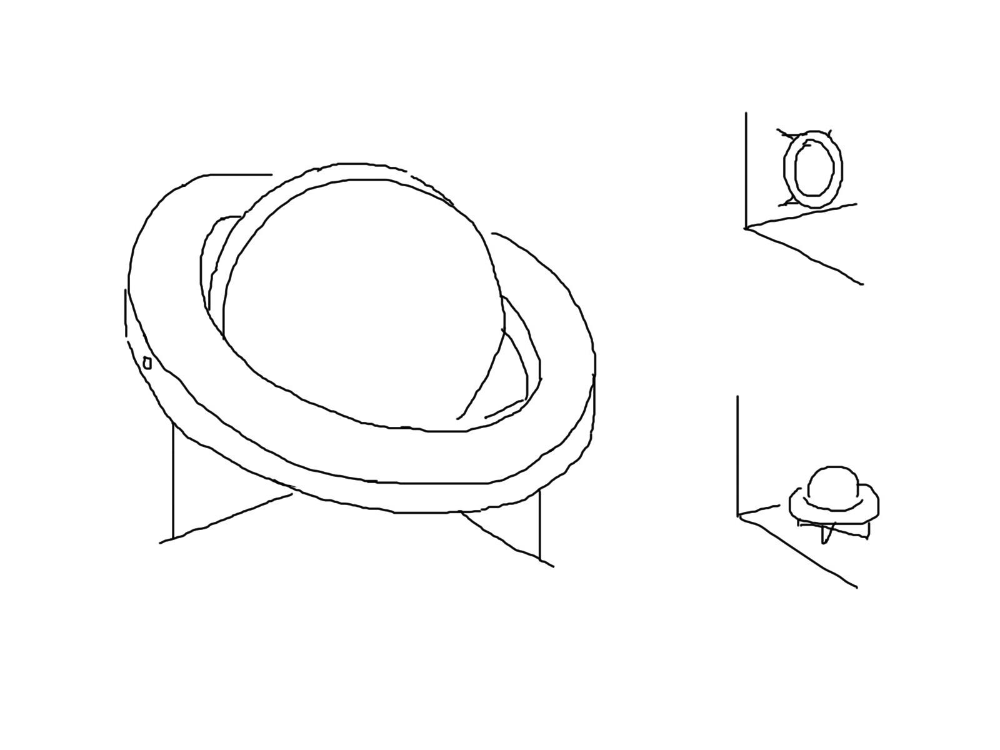

# RUBIK / 魔方房间

- 「魔方房间」是一种可以整体三轴旋转的房间，现已在程序上实现。其达到的效果类似于变换重力方向。

- 新一章的谜题将围绕若干个魔方房间展开。

## Gyroscope / 陀螺仪

### Introduction / 引入

- 此处的「**陀螺仪**」是一种外观类似机械陀螺仪的特定装置，实际效果与机械陀螺仪无关。由三部分组成，分别为**活板**、**外圈**和**支架**。支架与外圈相接，用于放置、固定在场景中。活板与外圈通过贯穿的中轴相连，使活板可以绕中轴旋转。

- 活板模拟受重力影响的效果，总是竖直的。因此，当该装置固定在墙面上时，活板与外圈能够组成回形；而当该装置固定在地面或天花板上时，活板与外圈无法组成回形。

  > 中轴的经纬方向根据装置的朝向动态改变。

- 陀螺仪出现且仅出现在魔方房间中。当任意陀螺仪组成了回形时，交互只有一种特异性结果：将支架所在的一面旋转至地面。也就是说，只有四面墙能被陀螺仪转至地面，在地面或天花板上的陀螺仪无法交互，也就无法旋转。
